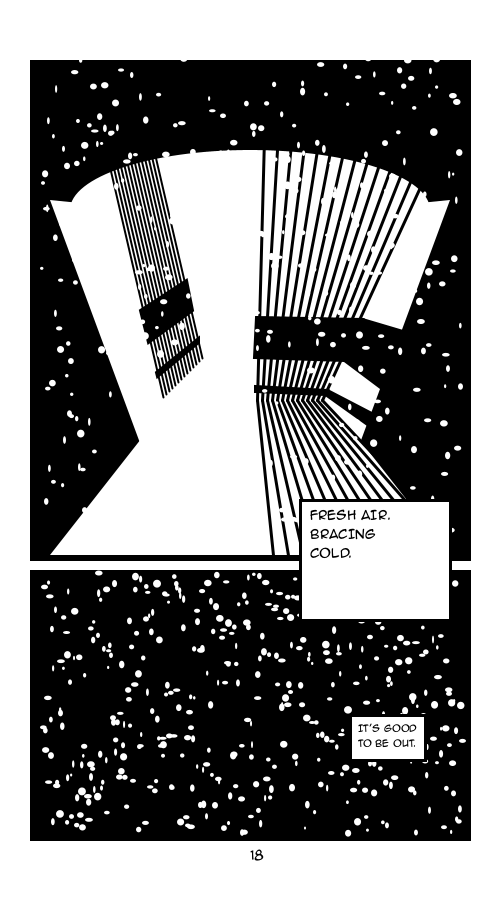
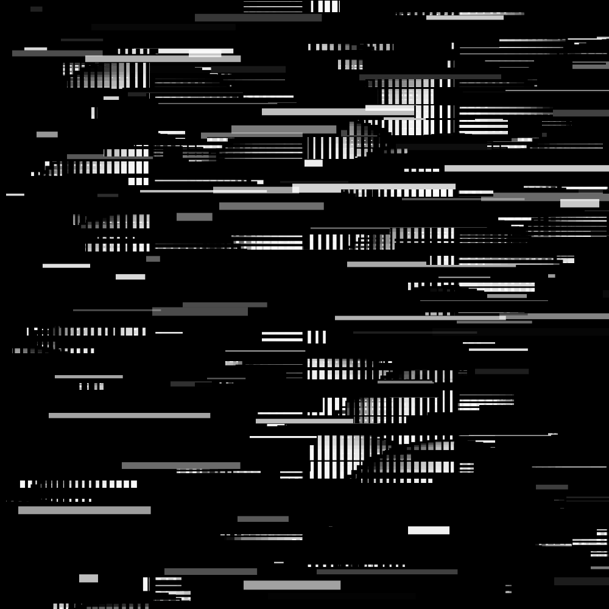
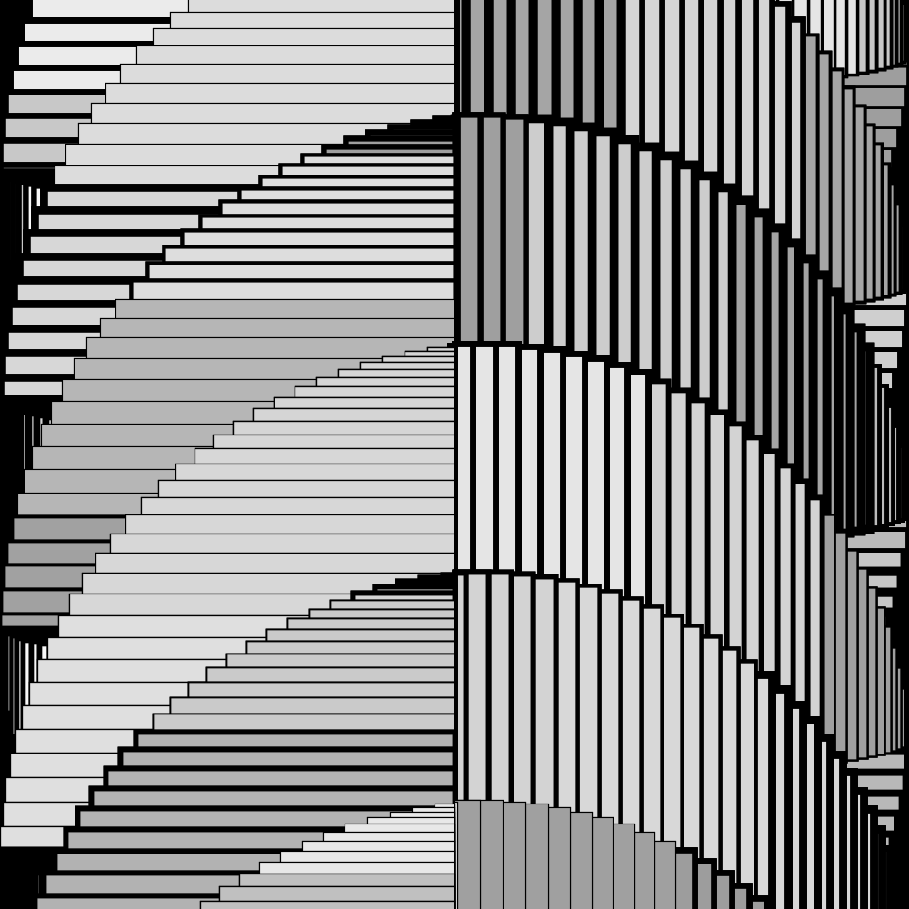
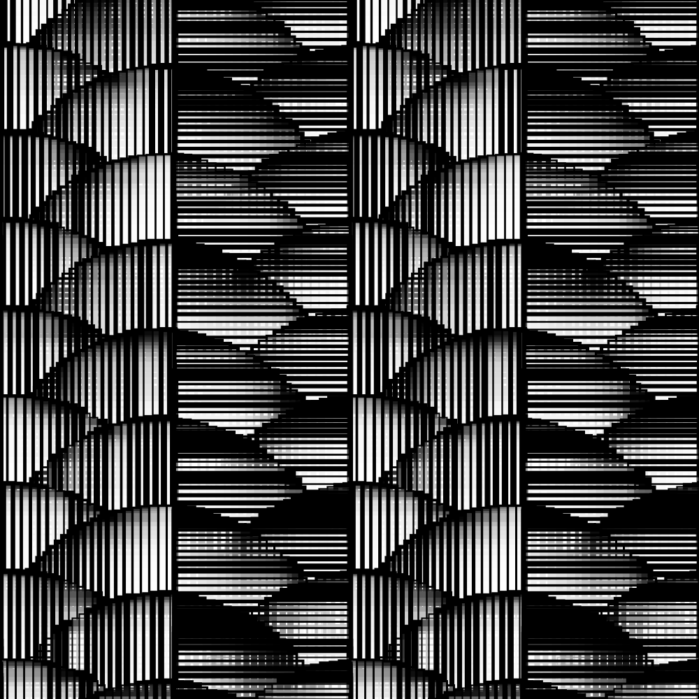
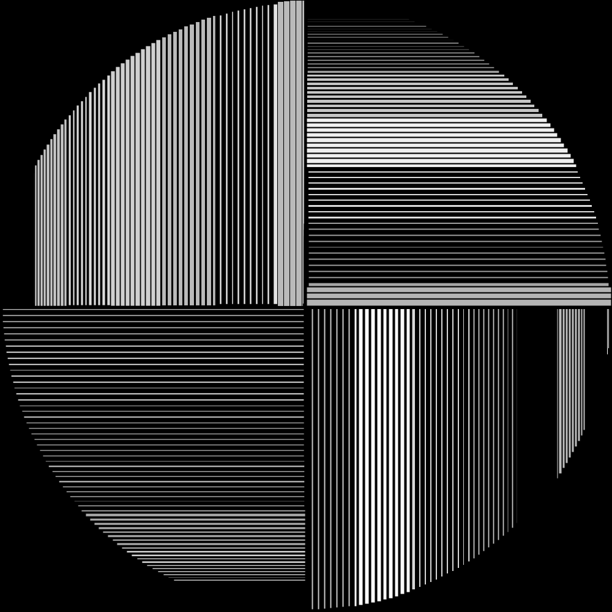
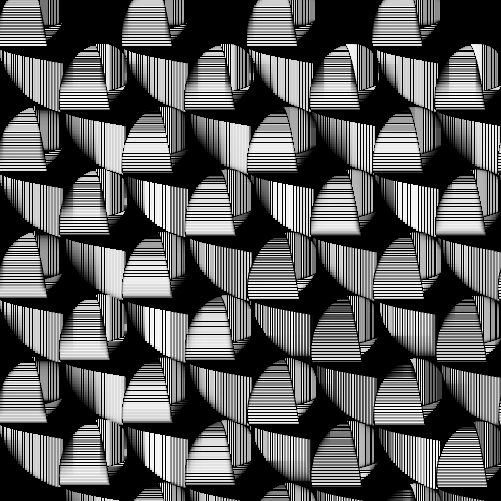
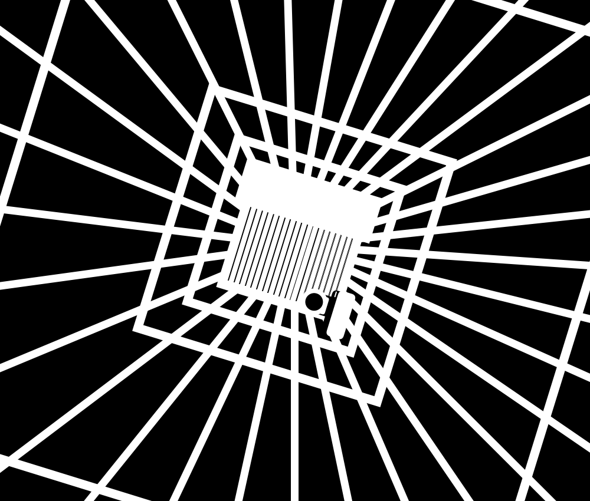
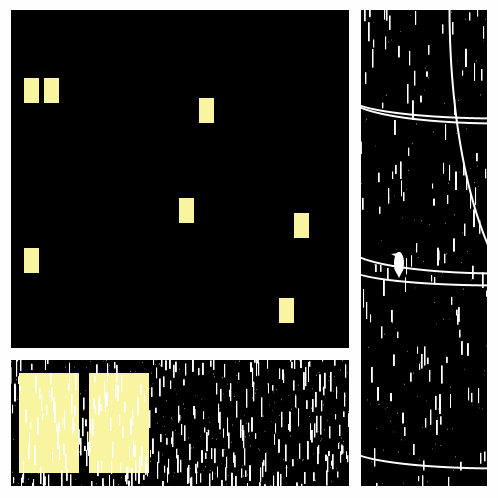
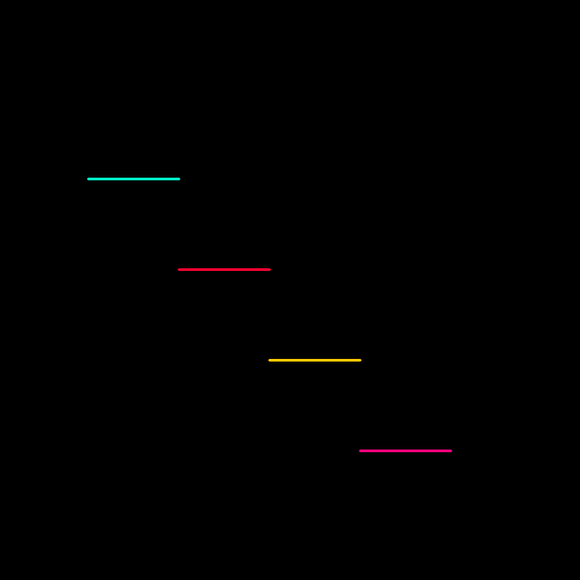
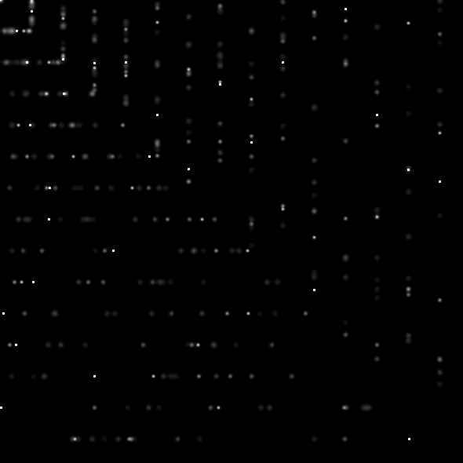

# Sketches

py5, Python Mode for Processing sketches

## Gallery

[sin_city_fresh_air.py](./sin_city_fresh_air.py)/py5
 
 

[glitch.py](./glitch.py)/py5
 
 

[frame4.py](./frame4.py)/py5
 
 

[frame3.py](./frame3.py)/py5
 
 

[frame2.py](./frame2.py)/py5
 
 

[frame1.py](./frame1.py)/py5
 
 

[ten_minutes.py](./ten_minutes.py)/py5
 
 

[sin_city_jail_cell.py](./sin_city_jail_cell.py)/py5/Processing Community Day 2023 Porto Official Selection
 
 

[tiny_story.py](./tiny_story.py)/py5/Processing Community Day 2022 Coimbra and Brazil Official Selection
 
 

[comic_rain.py](./comic_rain.py)/py5
 
 

[square.py](./square.py)/py5
 
 

[800x80.py](./800x80.py)/py5
 
 

[sketch_dots_line_white.py](./sketch_dots_line_white.py)/Python Mode for Processing
 
 

[sketch_lines_red.py](./sketch_lines_red.py)/Python Mode for Processing
 
 

[sketch_lines_green.py](./sketch_lines_green.py)/Python Mode for Processing
 
 

[sketch_dots_green.py](./sketch_dots_green.py)/Python Mode for Processing